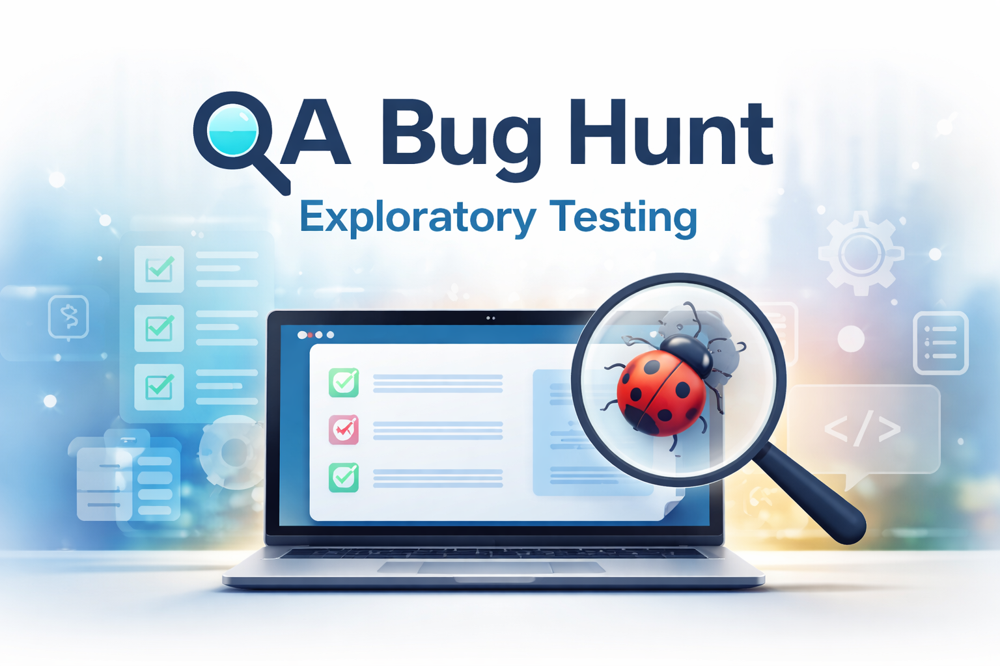

# QA Bug Hunt – DemoQA

Repository documenting bugs identified during exploratory testing of the DemoQA website.

Application tested:  
https://demoqa.com/

---

## Objective

Demonstrate practical QA skills including:

- exploratory testing
- bug identification
- validation analysis
- CRUD testing
- UI interaction testing
- documentation of software defects

---

## Bug Summary

| ID | Title | Category | Severity |
|----|------|----------|----------|
| BUG-001 | Close button does not close confirmation modal | UI Interaction | Medium |
| BUG-002 | Delete action removes incorrect record | CRUD / Delete | High |
| BUG-004 | Salary field does not display validation message | Validation / UX | Medium |
| BUG-005 | Edited record not reflected in WebTable | CRUD / Update | Medium |

---

## Repository Structure

bug-reports → detailed bug documentation  
evidence → screenshots and GIFs demonstrating issues

---

## Testing Approach

The issues documented here were discovered through:

- exploratory testing
- UI interaction testing
- validation testing
- CRUD operation testing